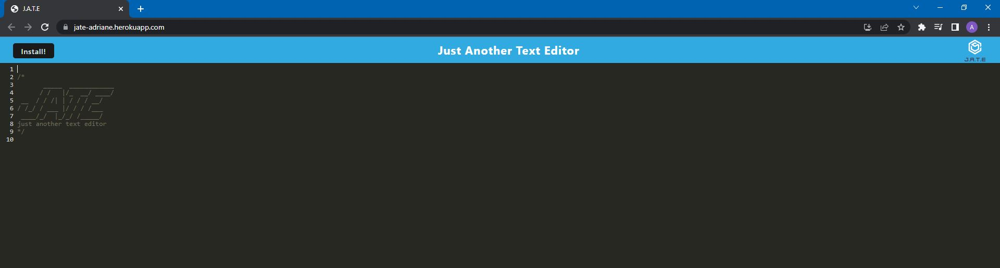
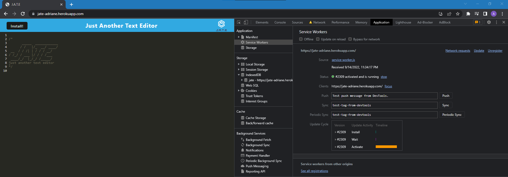

# Project Name - change to the name of your project
​
## Table of contents
​
- [Overview](#overview)
  - [The challenge](#the-challenge)
  - [User Story](#user-story)
  - [Acceptance Criteria](#acceptance-criteria)
  - [Screenshot](#screenshot)
  - [Links](#links)
- [My process](#my-process)
  - [Built with](#built-with)
  - [What I learned](#what-i-learned)
  - [Continued development](#continued-development)
  - [Useful resources](#useful-resources)
- [Author](#author)

## Overview
​
### The challenge
​
The challenge is to build a text editor that runs in the browser that meets PWA criteria and that will function offline. 
​
### User Story
​
```
AS A developer
I WANT to create notes or code snippets with or without an internet connection
SO THAT I can reliably retrieve them for later use
```
​
### Acceptance Criteria

```
GIVEN a text editor web application
WHEN I open my application in my editor
THEN I should see a client server folder structure
WHEN I run `npm run start` from the root directory
THEN I find that my application should start up the backend and serve the client
WHEN I run the text editor application from my terminal
THEN I find that my JavaScript files have been bundled using webpack
WHEN I run my webpack plugins
THEN I find that I have a generated HTML file, service worker, and a manifest file
WHEN I use next-gen JavaScript in my application
THEN I find that the text editor still functions in the browser without errors
WHEN I open the text editor
THEN I find that IndexedDB has immediately created a database storage
WHEN I enter content and subsequently click off of the DOM window
THEN I find that the content in the text editor has been saved with IndexedDB
WHEN I reopen the text editor after closing it
THEN I find that the content in the text editor has been retrieved from our IndexedDB
WHEN I click on the Install button
THEN I download my web application as an icon on my desktop
WHEN I load my web application
THEN I should have a registered service worker using workbox
WHEN I register a service worker
THEN I should have my static assets pre cached upon loading along with subsequent pages and static assets
WHEN I deploy to Heroku
THEN I should have proper build scripts for a webpack application
```
​
### Screenshot
​


​
### Links
​
- Live Site URL: [https://jate-adriane.herokuapp.com/](https://jate-adriane.herokuapp.com/)
​
## My process
​
### Built with
​
- Webpackplugin
- Heroku
- IndexedDB
​
### What I learned
​
In this challenge I learned how to use some of the webpack plugins that make our application work offline by using service workers, manifest, and storing data in indexedDB. Webpack is a great tool to help make the application more accessible to those who have unstable internet connection. However, webpack is somewhat confusing and difficult to troubleshoot. IndexedDB is great to use as a database for the browser. 
​
### Continued development
​
As I continue my career in tech, learning webpack will be beneficial in working in the industry as most companies and web application uses webpack. I found webpack difficult to debug so I hope as I practice and use more of it, it becomes easier to use. 
​
### Useful resources
​
- [IndexedDB documentation](https://developer.mozilla.org/en-US/docs/Web/API/IndexedDB_API) 
- [Resultfor.dev](https://resultfor.dev/837952-why-does-my-manifest-json-shows-page-does-not-work-offline) - Helped me figure out why my service worker was not showing up when it was offline
- [Service Worker](https://developer.mozilla.org/en-US/docs/Web/API/Service_Worker_API/Using_Service_Workers)

## Author
​
- Profile - [Adriane Ocampo](https://ocampoad.github.io/Adriane_Ocampo_Portfolio/)
- Github -  [Adriane Ocampo](https://github.com/ocampoad)
